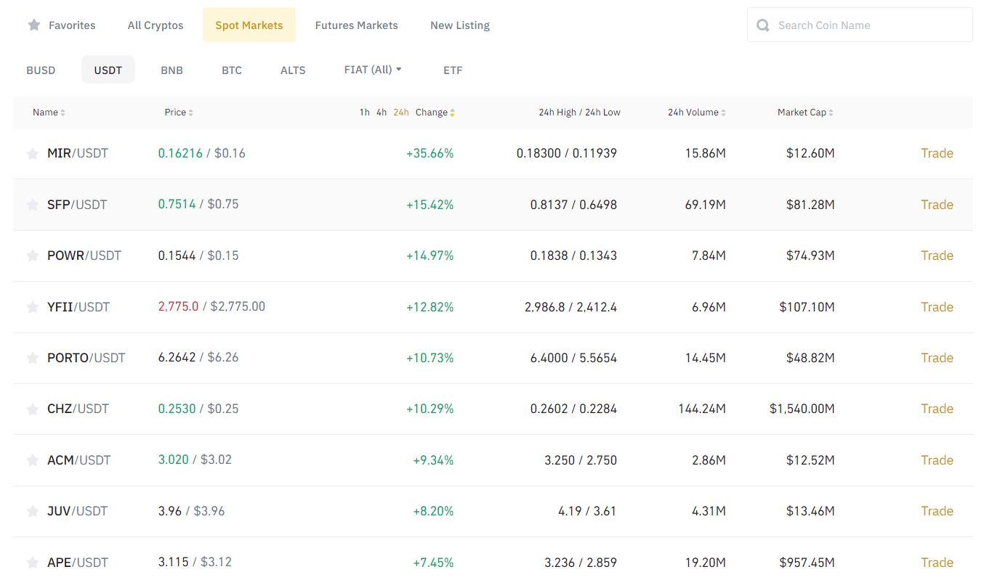

## Table of contents:
- [Introduction](#intro)
- [Technologies](#tech)
- [project Setup](#projo)
- [Illustrations](#illus)
- [Project Information](#info)
- [Contributing](#contri)
- [Acknowledgments](#know)

<INTRODUCTION>

<h1 id="intro">Pesa Mfukoni</h1>



**Binance-Supremacy-Battle**

A classical supremacy battle of who is the most fast(volatile) and strongest(momentum) coin/symbol pair  amongst usdt pairs within 24hrs . The battle takes place at the USDT SPOT MARKET (the base quote).There are two fronts; the bear front and the bulls front. Each battle lasts for 24hrs.

The draw  happens in the first 8 hrs starting from UTC +00.00  to select the top 10 strongest(momentum change) symbol pairs  in both fronts.

After the draw takes place, the top 10 symbol pairs are monitored at intervals of 4hrs( 4 times) and their vitals captured ( Open, High, low, close, Volume) and stored in a mysql database.

The battle ends at UTC +00.00 Upon which another battle preceeded with a draw commences.

The vitals are analyzed at the end of the 24hrs for each symbol pair and deductions made to determine if their speed and strength was steady for 16hrs after the draw.

The parameters of analysis are subject to further study .

The analysis will be served at an endpoint (e.g. using sandman2)


**Hypothesis**

- The top 10 symbol pairs can potentially yield a profit-margin of 1-2% after the draw.


<TECHNOLOGIES>

<h1 id="tech">Technologies</h1>

**Builth With**
- Python
- Mysql Database
- Pandas
- Binance API


<PROJECT-SETUP>

<h1 id="projo">Project Setup</h1>


## Hardware Requirements
- You will need a desktop or a laptop computer.
- RAM: A minimum of 4GB RAM is recommended.
- Disk Space: You should have at least 5GB free of space on your working hard drive.

## Software Requirements

**environment**

The project was developed in (wsl2 ubuntu environment) .

**Prerequisites**

To get this project up and running locally, you must already have the following installed:
- [python plus the necessary packages installed on your computer](https://www.python.org/downloads/)
- [code editor ](https://code.visualstudio.com/)
- [mysql workbench](https://dev.mysql.com/downloads/workbench/)
- [mysql server installed on your terminal](https://learn.microsoft.com/en-us/windows/wsl/tutorials/wsl-database)


**simple steps to set up on your local machine**

- git clone ```https://github.com/symonkipkemei/Pesa_Mfukoni.git ```
- set up your api key/secret key as virtual environment variable
- Set up and activate the virtual environment.


<ILLUSTRATIONS>

<h1 id="illus">Illustrations</h1>


<PROJECT-INFORMATION>

<h1 id="info">Project Information</h1>

**Project Status**
- In progress

**To do**
- 

**complete**
- 

**features**
- Your suggestions 😊............

<CONTRIBUTING>

<h1 id="contri">🤝 Contributing</h1>

Contributions, issues and feature requests are always welcome!

I love meeting other developers, interacting and sharing.

Feel free to check the [issues page](https://github.com/symonkipkemei/Pesa_Mfukoni/issues).

**How to Contribute**

To get a local copy up and running follow these simple example steps.

```
- Fork the repository
- git clone https://github.com/your_username/Pesa_Mfukoni
- git checkout develop
- git checkout -b branch name
- git remote add upstream https://github.com/symonkipkemei/Pesa_Mfukoni
- git pull upstream develop
- git commit -m "commit message"
- git push -u origin HEAD
```


<ACKNOWLEDGMENTS>

<h1 id="know">Acknowledgements</h1>

## Author

👤 **Symon Kipkemei**

- Github: [symonkipkemei](https://github.com/symonkipkemei)
- Twitter: [@symon_kipkemei](https://twitter.com/symon_kipkemei)
- LinkedIn: [Symon kipkemei](https://www.linkedin.com/in/symon-kipkemei/)


## Show your support


I can't promise to solve all your problems but I promise you won't have 
to face them alone 😊.

Finally, if you've read this far, don't forget to give this repo a ⭐️. 


## Acknowledgments

- [codingnomads](https://codingnomads.co/).
- [sqlalchemy documentation](https://www.sqlalchemy.org/)


